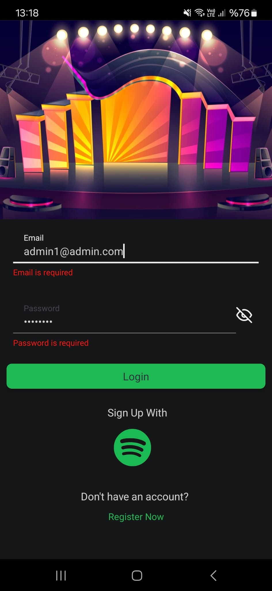
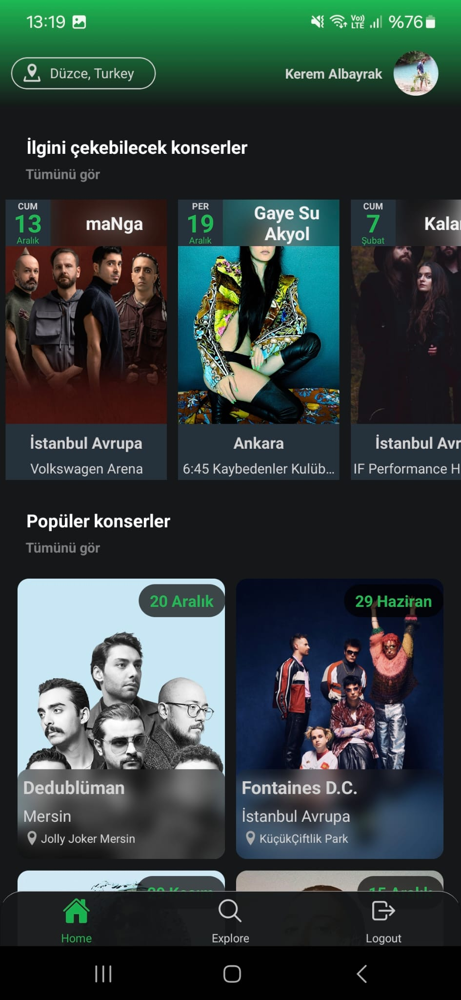
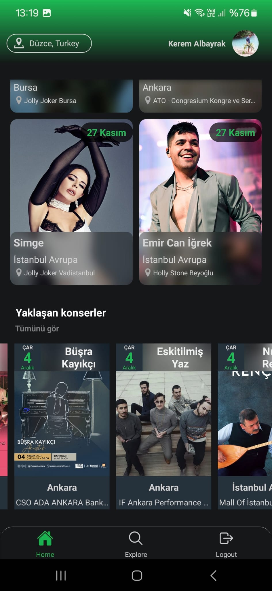
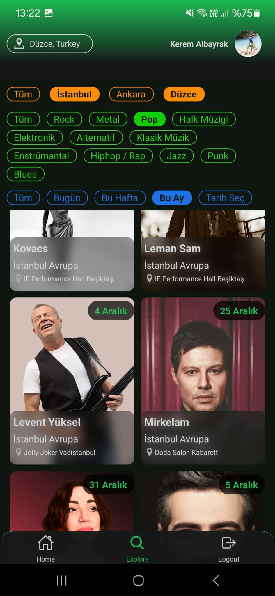
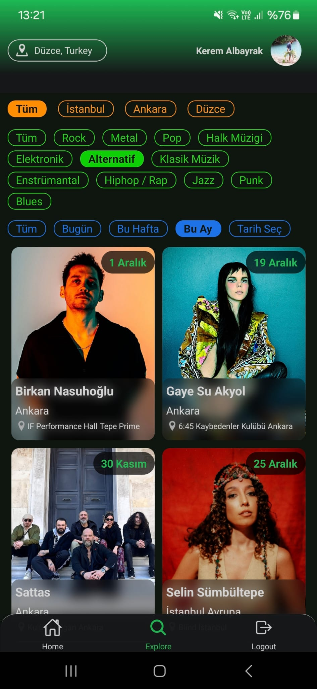

# KonserX

**KonserX**, kullanıcıların Türkiye'deki konserleri keşfetmesine, favori sanatçılarının konserlerini takip etmesine ve ilgi alanlarına göre yeni etkinlikler bulmasına olanak sağlayan bir React Native uygulamasıdır. Uygulama hala **geliştirilme aşamasında** olup, ilerleyen sürümlerde yeni özellikler eklenecektir.

## Özellikler

- **Spotify ile Giriş:** Spotify hesabınızla giriş yapabilir, favori sanatçılarınıza göre öneriler alabilirsiniz.
- **Kişiselleştirilmiş Öneriler:** Spotify müzik verilerinize ve beğenilerinize göre öneriler sunulur.
- **Popüler ve Yaklaşan Konserler:** Popüler sanatçıların ve yaklaşan konserlerin listesi.
- **Filtreleme:** Şehre, türe ve tarihe göre konser arama ve filtreleme.
- **Kullanıcı Konum Bilgisi:** Konumunuza göre öneriler sunar.
- **Çoklu Kimlik Doğrulama:** Email veya Spotify ile giriş yapabilirsiniz.
- **Navigation:** Kullanıcı dostu tab ve stack navigasyon.
- **Favori Tür Seçimi:** Spotify ile giriş yapmayan kullanıcılar için favori müzik türlerini seçme ekranı.

## Teknoloji Yığını

### Database

- **Azure SQL Database**: Uygulamanın temel veritabanıdır ve veriler düzenli bir şekilde saklanır. Aşağıdaki tablolar kullanılır:

  - **Concerts Tablosu**:
    - Web scraping ile elde edilen konser bilgilerini içerir.
    - **Python** kullanılarak, **BeautifulSoup** ile **biletinial.com** gibi web sitelerinden konser bilgileri (sanatçı adı, konser mekanı, şehir, tarih) çekilir.
    - Çekilen bilgiler düzenlenip sanatçı ismi trimlenerek tabloya kaydedilir.
    - Tablo, sanatçıların konser detaylarını kullanıcıya sunmak için temel bir veri kaynağıdır.

  - **Artists Tablosu**:
    - **Spotify API** üzerinden elde edilen sanatçı bilgilerini içerir:
      - Sanatçının adı, popülerlik puanı, Spotify’da kayıtlı müzik türleri, resmi (resim URL'si) ve Spotify ID’si.
    - Web scraping ile alınan sanatçı isimleri, Spotify API’de sorgulanır ve bu bilgiler tabloya kaydedilir.
    - Bu tablo, sanatçılarla ilgili detaylı bilgi ve öneri sunmak için kullanılır.

  - **Users Tablosu**:
    - Uygulama kullanıcılarının kayıtlarını ve kimlik doğrulama bilgilerini içerir.
    - Spotify ile giriş yapan kullanıcılar için Spotify’dan alınan isim ve email bilgileri burada saklanır.
    - Kullanıcıların tercihlerini yönetmek için temel bir tablodur.

  - **Genres Tablosu**:
    - Spotify’dan alınan müzik türlerini uygulamanın oluşturduğu 12 ana kategoriye eşler.
    - Tablo, kullanıcıların favori türlerine göre öneriler sunmak için Spotify türlerini kategorize eder.
    - Spotify türleri, bu tabloda bir liste şeklinde saklanarak dinamik ve genişletilebilir bir yapı sunar.

### Backend
- **Node.js ve Express.js** 
  - **Controllerlar:**
    - **`authController:`** Kullanıcı kimlik doğrulama ve token işlemleri.
    - **`artistsController:`** Sanatçılarla ilgili işlemler.
    - **`concertsController:`** Konser bilgileri yönetimi.
    - **`genresController:`** Tür eşleştirme işlemleri.
    - **`usersController:`** Kullanıcı yönetimi.

### Frontend
- **React Native & Expo**
  - **Navigation:** Bottom Tab Navigation ve Stack Navigation kombinasyonu.
  - **Formik:** Login ve register formları.
  - **React Query:** Veri mutasyonu ve yönetimi.
  - **Zustand & Async Storage:** Global ve kalıcı durum yönetimi.
  - **Geocode API:** Kullanıcı konum bilgisi için şehir ismi alma.

## Önemli Ekranlar

### Login / Register
- Spotify hesabıyla veya email ile giriş yapılabilir.
- Spotify ile girişte isim ve email bilgileri otomatik çekilir.
- Şifre işlemleri varsayılan bir şifreyle başlar, kullanıcı şifreyi değiştirebilir.
- JWT token ile kimlik doğrulama yapılır.

### Home Screen
- **İlgini Çekebilecek Konserler:** 
  - Spotify takipçileri veya favori türlere göre öneriler.
- **Popüler Konserler:**
  - Spotify popülerlik derecesine göre sıralama yapılır.
- **Yaklaşan Konserler:**
  - Keşfet sayfasına yönlendirme yapılır.

  
  

### Keşfet Sayfası
- Şehre, türe ve tarihe göre filtreleme yapılabilir.
- Filtreleme sonuçları backend'den dinamik olarak alınır.

  
  
    

## Kurulum ve Çalıştırma

Gereksinimler
- Node.js
- Expo CLI
- Azure SQL Database erişimi
- Spotify Developer API hesabı

## İleride Eklenecek Özellikler

### Takip Edilen Konserler:
- Kullanıcının takip ettiği konserleri görüntüleyebileceği bir ekran.
- Konser tarihi yaklaştığında bildirim gönderilmesi.

### Konser Detayları:
- Bilet Satın Alma: Konser detayı sayfasında Biletinial sitesine yönlendiren bir buton.
- Mekan Gösterimi: Konser detayı sayfasında mekanın harita üzerinde gösterimi.
- Sanatçı Şarkıları: Konser detayı sayfasında Spotify API ile sanatçının şarkılarını uygulama arayüzünden dinleyebilme özelliği.

### Kullanıcı Profil Sayfası:
- Profil resmi ekleyebilme.
- Favori müzik türlerini görüntüleyebilme ve düzenleyebilme.
- Şifre değiştirebilme özelliği.

### Favori Tür Seçimi:
- Spotify ile giriş yapmayan kullanıcıların konser önerileri alabilmesi için favori müzik türlerini seçebileceği bir ekran.
